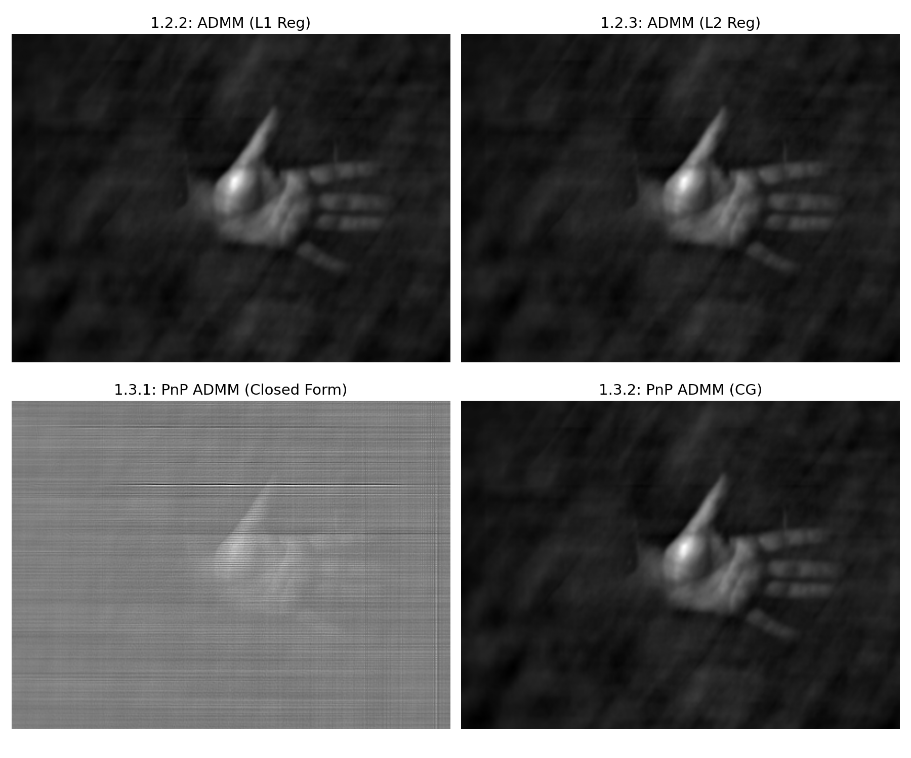
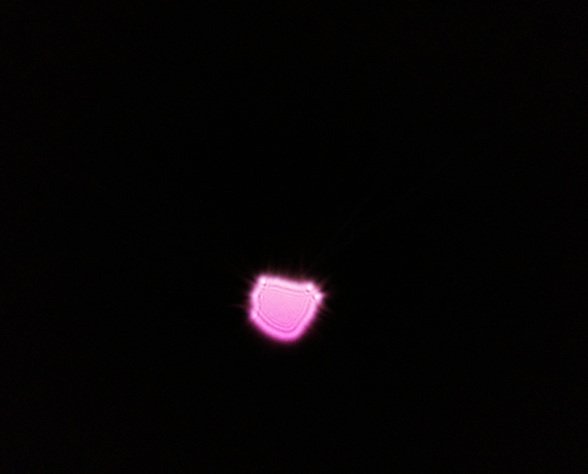
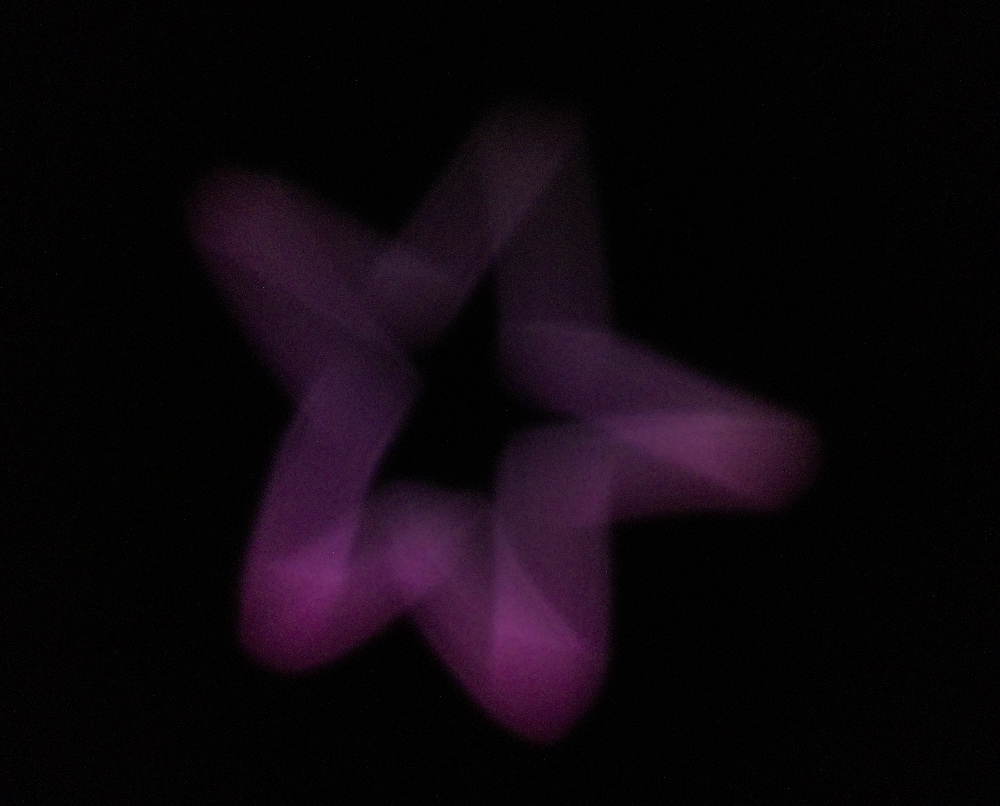
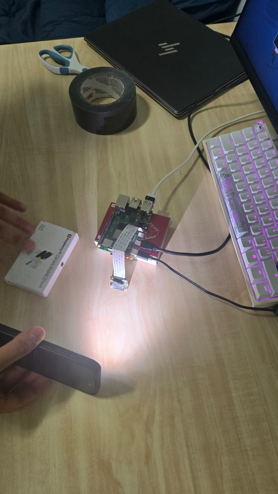
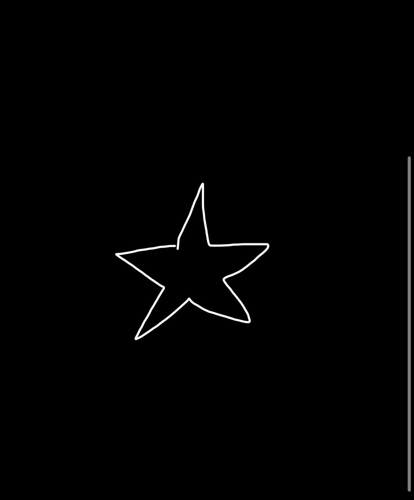
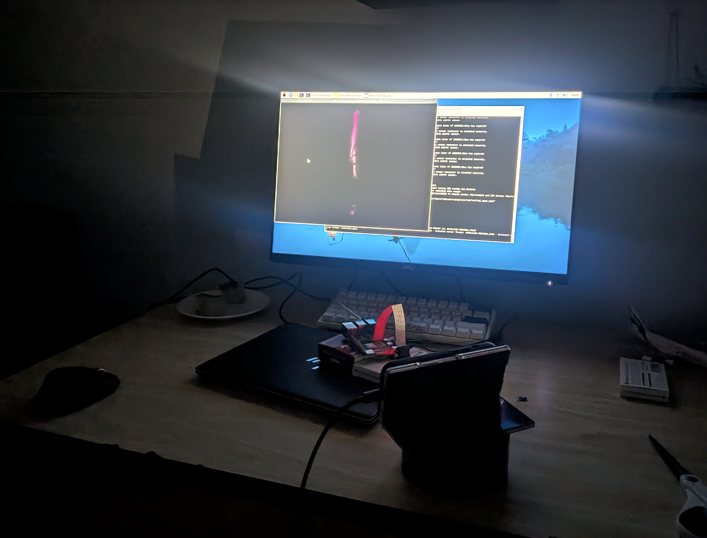
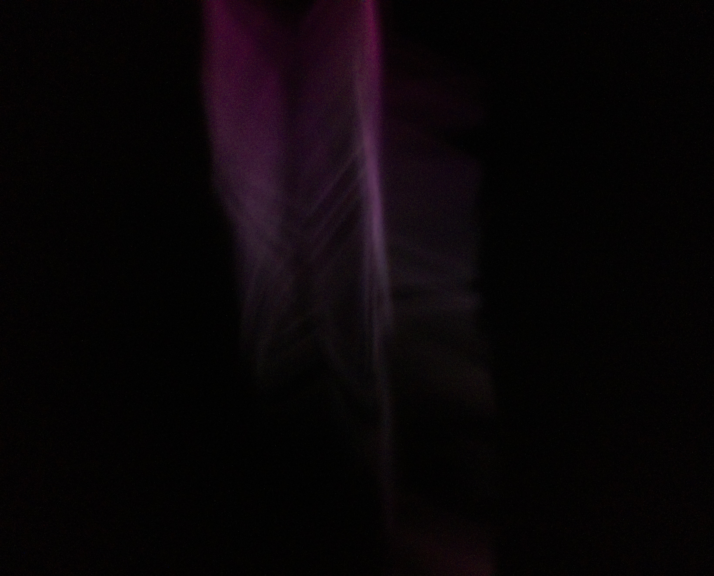

# 1.1 & 1.2.1: Data Loading, Preprocessing, and System Setup {#data-loading-preprocessing-and-system-setup .unnumbered}

The raw DiffuserCam sensor measurement and Point Spread Function (PSF)
were loaded, downsampled for computational efficiency, and bounded using
padding to prevent circular convolution artifacts. \[Code Reused from
ADMM.ipynb\]: The specific logic for background subtraction, the
box-filter `resize()` function, and L2 normalization.\
\
**Total Variation (TV):** In the ADMM formulation, the data fidelity
term is $f(x) = \frac{1}{2}\|Ax - b\|_2^2$ and the regularization term
is $g(v) = \tau TV(v)$. The total variation of an image is defined as
$TV(x) = \sum_{i,j} \sqrt{|x_{i+1,j} - x_{i,j}|^2 + |x_{i,j+1} - x_{i,j}|^2}$.
Minimizing total variation removes high-frequency noise while preserving
sharp edges, effectively promoting piecewise constant images.

# 1.2.2: ADMM with L1 Regularization {#admm-with-l1-regularization .unnumbered}

The Alternating Direction Method of Multipliers (ADMM) algorithm was
implemented using the Conjugate Gradient method for the main image
update, incorporating a pixel-wise soft thresholding step to enforce L1
sparsity. Non-negativity constraints were actively enforced at each
iteration.\
\
**Optimization Objective:**
$\min_x \frac{1}{2}\|Ax - b\|_2^2 + \tau \|x\|_1$.\
**Effect:** L1 regularization promotes sparsity in the reconstructed
image. It heavily penalizes non-zero pixels, driving small background
noise artifacts to exactly zero, which is ideal for isolating sparse,
bright features.

# 1.2.3: ADMM with L2 Regularization {#admm-with-l2-regularization .unnumbered}

The ADMM algorithm was adapted by replacing the soft-thresholding step
with an L2 shrinkage formula (Tikhonov-like penalty). The iterative
Conjugate Gradient solver remained in place to handle the forward
optical model with cropping.\
\
**Optimization Objective:**
$\min_x \frac{1}{2}\|Ax - b\|_2^2 + \tau \|x\|_2^2$.\
**Effect:** L2 regularization penalizes the squared magnitude of pixel
values. Unlike L1, it prevents any single pixel from becoming too large
but does not drive values to zero, generally resulting in a smoother,
less sparse, and more blurred image.

# 1.3.1: Plug and Play ADMM - Closed Formula Update {#plug-and-play-admm---closed-formula-update .unnumbered}

The image update step was optimized using a direct, closed-form
inversion in the Fourier domain (frequency-domain division), bypassing
the need for an iterative solver. For regularization, the BM3D algorithm
was used as a \"Plug and Play\" denoiser on the auxiliary variable.

# 1.3.2: Plug and Play ADMM - Conjugate Gradient Update {#plug-and-play-admm---conjugate-gradient-update .unnumbered}

This section merged the Conjugate Gradient solver for the main image
update with the BM3D denoiser for the auxiliary variable. This approach
ensures more robust handling of the forward model's matrix cropping
while benefiting from advanced spatial denoising.

# Reconstruction Result {#reconstruction-result .unnumbered}

<figure id="fig:results" data-latex-placement="h">

<figcaption>Reconstructed images comparing L1, L2, and Plug-and-Play
BM3D regularization methods.</figcaption>
</figure>

# 2.2 Standard Pinhole Camera (Minimal Multiplexing)

<figure data-latex-placement="H">

<figcaption>PSF of standard aperture</figcaption>
</figure>

<figure data-latex-placement="H">

<figcaption>Star captured with standard aperture</figcaption>
</figure>

<figure id="fig:placeholder" data-latex-placement="H">

<figcaption>PSF of larger standard aperture</figcaption>
</figure>

<figure id="fig:placeholder" data-latex-placement="H">

<figcaption>Star captured with larger standard aperture</figcaption>
</figure>

Increasing the aperture size makes the star blurrier. The brightness in
the two images is roughly equal despite the darker PSF for the larger
aperture. It was difficult to adjust the background light in this
instance without too much glare and exposure. Naturally, however, a
larger PSF should indeed bring in more light and hence result in a
brighter image. The increased blur can be explained by how light is
spread over a larger area on the sensor; the larger the aperture, the
more locations on the sensor that a single point in the scene will map
to, interfering with the similarly-spread-out mapping of other nearby
(or not-so-nearby) points. This results in fine details being lost and
having to be recovered through reconstruction.

# 2.3 Imaging with a Non-Standard Aperture 

To make the aperture non-standard, we made a slit in tape instead of a
pinhole.

<figure data-latex-placement="H">

<figcaption>System before capture of PSF</figcaption>
</figure>

<figure data-latex-placement="H">

<figcaption>Aperture design (PSF of slit)</figcaption>
</figure>

To capture an image with this slit aperture, we displayed a drawing of a
star on a phone screen. It was illuminated by the phone's brightness and
an additional flashlight pointed towards the screen. It was captured by
the sensor covered with our custom slit aperture.

<figure data-latex-placement="H">

<figcaption>Target displayed on phone screen</figcaption>
</figure>

<figure data-latex-placement="H">

<figcaption>System immediately after capture of target</figcaption>
</figure>

<figure data-latex-placement="H">

<figcaption>Capture of star image with slit aperture</figcaption>
</figure>

# 2.4 PSF Calibration and Measurement

In an ideal pinhole camera, the Point Spread Function (PSF) is
theoretically a single point. However, for non-standard apertures, the
PSF is a geometric projection of the aperture's shape onto the image
plane. As shown in the images below, the measured PSFs directly
correspond to the physical shape of the custom masks used in our
experiments.

<figure data-latex-placement="H">

<figcaption>PSF of four holes aperture</figcaption>
</figure>

<figure data-latex-placement="H">

<figcaption>PSF of slit aperture</figcaption>
</figure>

<figure data-latex-placement="H">

<figcaption>PSF of two holes aperture</figcaption>
</figure>

The relationship between the aperture and the resulting images is made
up by the convolution of the scene with the PSF. While a single pinhole
provides a sharp but dim image, a non-standard aperture increases the
light received at the cost of sharpness/introduced ambiguity.

For instance, the four-hole aperture creases a PSF consisting of four
discrete light points. In the captured image, every point source in the
scene is rendered as four distinct replicas. This introduced significant
"ghosting" or blur compared to the single pinhole case. Similarly, the
slit aperture spreads light along a vertical axis, where it maintained
sharpness the perpendicular direction/the horizontal axis. In all,
obtaining and calibrating these PSFs are essential for any subsequent
deconvolution or computational reconstruction of the original scene.

# 2.5 ADMM Reconstruction

We captured a picture of a star using the slit aperture shown in
Sections 2.3 and 2.4.

<figure data-latex-placement="H">

<figcaption>Ground truth image</figcaption>
</figure>

<figure data-latex-placement="H">

<figcaption>PSF of slit aperture</figcaption>
</figure>

<figure data-latex-placement="H">

<figcaption>Captured image</figcaption>
</figure>

Let's first reconstruct the captured image with ADMM under L1 and L2
regularization.

<figure data-latex-placement="H">

<figcaption>ADMM with L1 regularization</figcaption>
</figure>

<figure data-latex-placement="H">

<figcaption>ADMM with L2 regularization</figcaption>
</figure>

Both L1 and L2 regularization were run with the following parameters:

mu_1 = 1times10^{-6}
mu_2 = 1times10^{-5}
mu_3 = 4times10^{-5}
tau = 0.0001

Now let's use Plug and Play ADMM with the BM3D denoiser. Note that, as
suggested in the assignment description, our algorithm modifies the
monotone update rule for rho_k described in equation 15 of
https://arxiv.org/pdf/1605.01710 by ignoring eta and setting
gamma = 1 (thereby keeping rho constant).

We first run the algorithm with the following regularization
parameters:

rho       = 1times10^{-2}
lambda   = 1times10^{-4}

We chose lambda and rho_0 so that their ratio
(sigma = sqrt{frac{lambda}{rho}}  = 0.1) was similar to the
optimal sigma_{psd} value from the denoising homework that used BM3D.
Here is the reconstruction:

<figure data-latex-placement="H">

<figcaption>ADMM with L1 regularization</figcaption>
</figure>

It's still pretty noisy. Let's decrease the distance between lambda
and rho in order to increase the sigma and increase smoothing.

rho      = 1times10^{-2}
lambda   = 1times10^{-3}

<figure data-latex-placement="H">

<figcaption>ADMM with L1 regularization</figcaption>
</figure>

This is better as the background has less static, but the star itself is
still not great. Let's try doubling the number of iterations.

<figure data-latex-placement="H">

<figcaption>ADMM with L1 regularization</figcaption>
</figure>

This looks slightly worse, and took a while to run. We might be
overshooting with that combination of iterations and rho. Let's
increase sigma again:

rho       = 1times10^{-2}
lambda   = 4times10^{-3}

<figure data-latex-placement="H">

<figcaption>ADMM with L1 regularization</figcaption>
</figure>

This ratio (sigma = sqrt{0.4}) seems to de-blur reasonably. Now,
let's increase rho while maintaining that ratio to see if a smaller
step-size will yield a better 10-iteration-reconstruction: Remember,
while the ratio between lambda and rho determines how aggressively
BM3D runs, the absolute value of rho affects step-size by penalizing
how far x can stray from v - u per iteration:

x^{(k+1)} ={argmin}_{x}|{G}{x} - {y}|^2 + frac{rho}{2}|{x} - (v^k - u^k)|^2

rho       = 1
lambda   = 4times10^{-1}

<figure data-latex-placement="H">

<figcaption>ADMM with L1 regularization</figcaption>
</figure>

This is the best one so far. Let's increase rho while maintaining
sigma one more time, with a big jump.

rho       = 5
lambda   = 2

<figure data-latex-placement="H">

<figcaption>ADMM with L1 regularization</figcaption>
</figure>

We've recovered some of the thinner lines at the bottom of the star at
the expense of a bit more noise primarily inside and below the star.

Multiplexed images, as those captured with a vertical slit aperture, are
much harder to reconstruct. You need strong deblurring to remove the
many stacked "shadows", but in doing so sacrifice thinner lines/finer
details.
